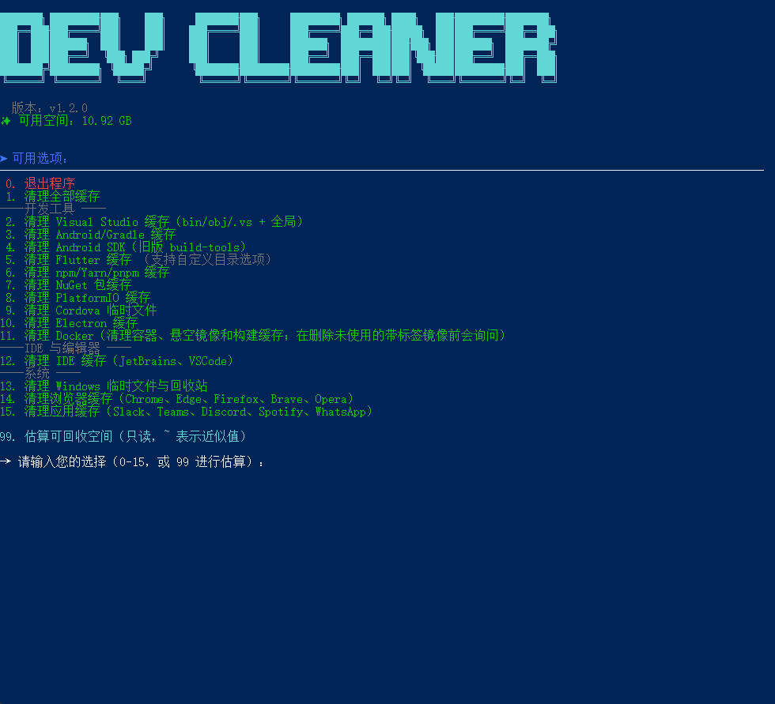

> **汉化声明**：本 README 由 GitHub Actions 自动汉化自上游仓库 [jemishavasoya/dev-cleaner](https://github.com/jemishavasoya/dev-cleaner) 的 `README.md`（上游 ref：`main`）。
>
> - 上游仓库：https://github.com/jemishavasoya/dev-cleaner
> - 原始文件：https://github.com/jemishavasoya/dev-cleaner/blob/main/README.md
> - 本仓库（dev-cleaner-zh-cn）使用与配置说明：**[how2use](https://github.com/9thChasingWindGirl/dev-cleaner-zh-cn/wiki/how2use)**

---

# 🧹 Dev Cleaner 工具

<p align="center">
    <a href="YOUR_GITHUB_REPO_LINK">
        
    </a>
    <a href="YOUR_GITHUB_REPO_LINK/stargazers">
        
    </a>
</p>

<p align="center">
  <br>
</p>

## 支持最新的 macOS/Linux/Windows 开发环境

本工具仅供**教育用途**，专注于安全地清理与开发相关的垃圾文件（Xcode、Flutter、Visual Studio、npm 等），以释放磁盘空间。

---

### ✨ 功能特性

* **一键清理：** 清理 Xcode、Flutter、Visual Studio、Gradle、npm、NuGet、IDE 和浏览器缓存。
* **全面的 Flutter 清理：** 递归查找并清理所有 Flutter 项目，移除：
  * FVM SDK 缓存和配置（`.fvm`、`.fvmrc`）
  * Flutter 构建产物（`build`、`.dart_tool`、`.packages`、`pubspec.lock`）
  * Android Gradle 缓存（`android/.gradle`、`android/build`、`android/app/build`）
  * iOS CocoaPods 缓存（`ios/Pods`、`ios/Podfile.lock`、`ios/.symlinks`、Flutter 框架）
  * 全局 Flutter 缓存
* **交互式菜单：** 允许选择特定的清理目标（例如仅清理 Xcode）。
* **多平台支持：** 支持 **macOS**、**Linux** 和 **Windows**。

---

### 💻 系统支持

| 操作系统 | 架构 | 是否支持 |
| :--------------- | :----------- | :-------- |
| macOS            | Intel, Apple Silicon | ✅        |
| Linux            | x64, ARM64   | ✅        |
| Windows          | x64, ARM64   | ✅        |

---

### 👀 使用方法

#### ⭐ 自动运行脚本

**Linux/macOS**

通过一行命令下载、授权并运行该工具：

```bash
curl -fsSL https://raw.githubusercontent.com/jemishavasoya/dev-cleaner/main/dev-cleaner.sh -o dev-cleanup.sh && chmod +x dev-cleanup.sh && ./dev-cleanup.sh
```

#### 🍺 通过 Homebrew 安装

**macOS/Linux**

使用 Homebrew 进行永久安装：

```bash
# 添加仓库
brew tap jemishavasoya/dev-cleaner

# 安装 dev-cleaner
brew install dev-cleaner

# 运行工具
dev-cleaner

# 查看版本
dev-cleaner --version
```

更新到最新版本：

```bash
brew update
brew upgrade dev-cleaner
```

卸载：

```bash
brew uninstall dev-cleaner
brew untap jemishavasoya/dev-cleaner
```

#### 🪟 Windows 安装

**PowerShell（以管理员身份运行）**

##### 一行命令下载并运行

```powershell
irm https://raw.githubusercontent.com/jemishavasoya/dev-cleaner/main/dev-cleaner.ps1 -OutFile dev-cleaner.ps1; .\dev-cleaner.ps1
```

> **注意：** 您可能需要先设置执行策略：
> ```powershell
> Set-ExecutionPolicy -ExecutionPolicy RemoteSigned -Scope CurrentUser
> ```

##### 手动下载

1. 从本仓库下载 `dev-cleaner.ps1`
2. 右键单击该文件 → **使用 PowerShell 运行**，或
3. 以管理员身份打开 PowerShell 并运行：
   ```powershell
   .\dev-cleaner.ps1
   ```

##### 命令行选项

```powershell
# 显示帮助
.\dev-cleaner.ps1 -Help

# 显示版本
.\dev-cleaner.ps1 -Version

# 自定义 Flutter 项目目录
.\dev-cleaner.ps1 -FlutterDir "C:\Projects\Flutter"

# 自定义 Visual Studio 项目目录
.\dev-cleaner.ps1 -VsDir "C:\Projects\DotNet"

# 同时指定两个自定义目录
.\dev-cleaner.ps1 -FlutterDir "D:\Flutter" -VsDir "D:\VisualStudio"
```

##### 环境变量

```powershell
# 在 PowerShell 配置文件中设置以实现持久化
$env:FLUTTER_SEARCH_DIR = "C:\Projects\Flutter"
$env:VS_SEARCH_DIR = "C:\Projects\DotNet"
```

##### Windows 专属清理

Windows 版本包含所有跨平台清理功能，此外还包括：

- **Visual Studio：** 清理所有 .NET 项目的 `bin/`、`obj/`、`.vs/` 文件夹，以及全局 VS 缓存（ComponentModelCache、MEFCacheData）
- **NuGet：** 清除全局包缓存（`~/.nuget/packages`）、HTTP 缓存和临时文件
- **Windows 临时文件夹：** 清除用户和系统临时文件夹，以及回收站

> **注意：** 部分操作需要管理员权限。脚本会在需要时自动请求提升权限。

#### 🧹 Flutter 清理详情

Flutter 清理选项（选项 4）会对从当前目录开始的所有 Flutter 项目执行全面的递归清理。它会：

- **递归搜索**所有 `pubspec.yaml` 文件
- **移除 FVM** SDK 缓存和配置
- **清理构建产物**：`build/`、`.dart_tool/`、`.packages`、`pubspec.lock`
- **移除每个项目的 Android Gradle** 缓存
- **移除 iOS CocoaPods** 缓存和 Flutter 框架
- **清理全局 Flutter 缓存**

**💡 专家提示：** 如果您有日常活跃的项目，建议从特定的子目录（例如 `~/old_projects` 或 `~/research`）运行清理，而不是整个开发文件夹。这样可以避免对活跃项目的不必要依赖重新构建。

**预期节省空间：** 用户报告称，在多个项目上运行 Flutter 清理后，可释放 50-100GB+ 的磁盘空间。
您也可以请我喝杯咖啡 &nbsp;&nbsp;&nbsp;&nbsp;&nbsp;&nbsp;<a href="https://www.buymeacoffee.com/jempatellbv" target="_blank"></a>

## 🤩 参与贡献 

我们欢迎您提交问题和拉取请求！

<a href="https://github.com/jemishavasoya/dev-cleaner/graphs/contributors">
  
</a>
<br /><br />

## 常见问题

### 权限错误
- 如果在运行脚本时遇到权限错误，请尝试使用 `sudo`（Linux/macOS）或以管理员身份（Windows）运行。

### 清理后可用空间未变化（macOS）

摘要中特意打印了两个不同的值：

```
Reclaimed:  ~3.0Gi
Free space: 21.4Gi → 21.4Gi
```

**`Reclaimed` 是根据实际删除的文件来测量的**——这些数据已消失。**可用空间可能会滞后**，因为 APFS 会保持已删除文件的块分配，只要 Time Machine *本地快照*仍引用它们（访达将此称为"可清除"空间）。macOS 会自动释放它，通常在 24 小时内或磁盘空间紧张时释放。

要立即找回空间，请运行 **选项 17（移除 Time Machine 本地快照）**——或检查什么被固定住了：

```bash
tmutil listlocalsnapshots /
```

另外两种可用空间滞后的情况：应用仍保持已删除文件打开（退出 Xcode、模拟器、浏览器），以及 Docker——`docker system prune` 会在 Docker 自己的磁盘映像内部释放空间，主机只有在 Docker Desktop 压缩该映像后才能看到它。

### 找不到工具
- 确保 `flutter` 或 `brew` 等工具已安装并添加到系统 PATH 中。
- 在 macOS/Linux 上，使用 `echo $PATH` 检查 PATH。
- 在 Windows 上，检查系统设置中的环境变量。
